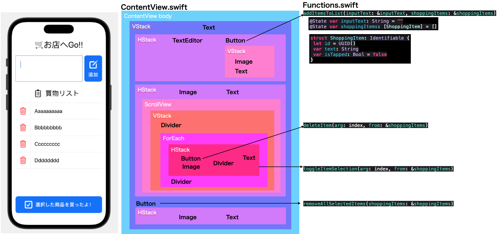

# アプリ名: お店へGo!!

## 目次
1. [必要条件](#必要条件)
2. [使用言語、環境、テクノロジー](#使用言語環境テクノロジー)
3. [システム構成図](#システム構成図)
4. [使い方](#使い方)
   - [インストール方法](#インストール方法)
   - [テスト方法](#テスト方法)
   - [デプロイ方法](#デプロイ方法)
5. [こだわりポイント](#こだわりポイント)
6. [ライセンス情報](#ライセンス情報)
7. [今後の計画](#今後の計画)

## 必要条件
 - MacOS Ventura 13.4
 - Xcode14.3.1

## 使用言語、環境、テクノロジー
 - SwiftUI
 
## システム構成図
 

## 使い方

### インストール方法
 - App Store から [Xcode](https://apps.apple.com/jp/app/xcode/id497799835?mt=12) をインストール
 
### テスト方法
 - 未実施

### デプロイ方法
 - 未実施

## こだわりポイント
 - スマホでの利便性を考慮 
 
## ライセンス情報
 - 勉強中 

## 今後の計画
 - 陳列棚に沿ったソート機能
 - 店舗ごとの陳列棚の並び順をカスタマイズ
 - 商品と陳列棚のデータ
 - 手動での並び替え

